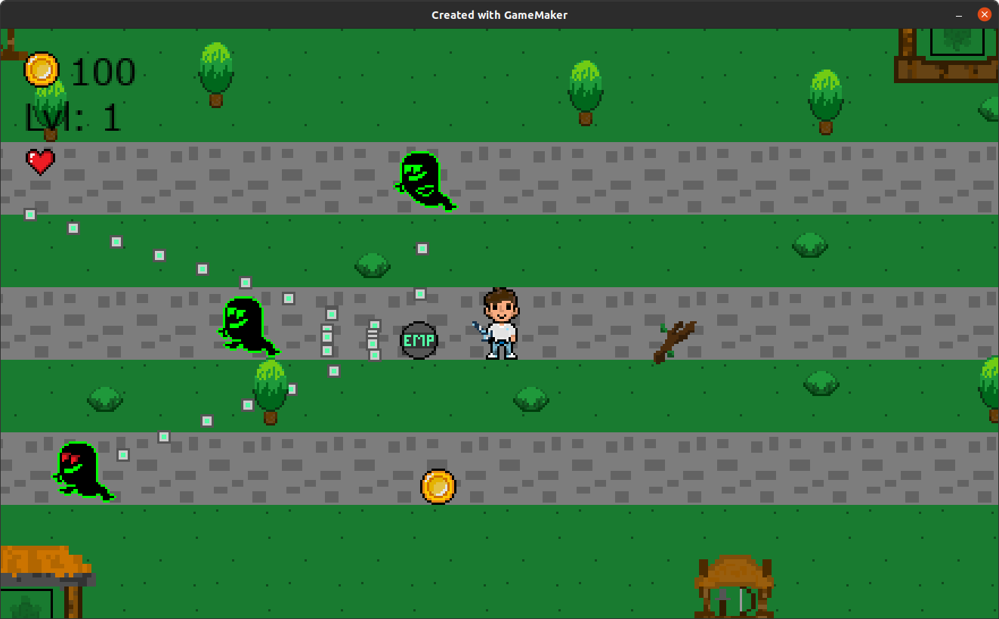

# Jester Game Arcade 👾👻🦖🏆

Jester Game Arcade is an interactive, Halloween-themed gesture-based arcade that allows players to control games using only their hand movements through a webcam. Created as a spooky Halloween project for our first hackathon, [HackNotts 24](https://www.hacknotts.com/) this arcade hub provides access to unique gesture-controlled games for a fun and immersive experience. We won Spookiest Hack for our first time, here is the [Devpost](https://devpost.com/software/jester-game-arcade).


## Table of Contents
- [Inspiration](#inspiration)
- [Overview](#overview)
- [How It Works](#how-it-works)
- [Features](#features)
- [Challenges](#challenges)
- [Setup & Installation](#setup--installation)
- [Built With](#built-with)

## Inspiration
Inspired by consoles like the Wii Kinect and Xbox Kinect, we wanted to create a gaming experience that adds depth through movement and hand gestures. This project was the perfect opportunity for our first hackathon challenge!

## Overview
Jester Game Arcade is a Halloween-themed arcade hub where players can access gesture-controlled games designed for spooky, seasonal fun. We created **Ghost Runner**, and the arcade also includes a gesture-controlled **Dino Game** (utilising an online version to showcase compatibility), offering exciting gameplay with only a webcam and our custom software.

### Key Games
- **Ghost Runner**: We created this game in Gamemaker Studio 2, where players dodge obstacles and enemies, collect power-ups, and navigate lanes by gesturing.


- **Dino Game**: A Halloween twist on the classic game, adapted to gesture control. This game is sourced online to demonstrate how the Jester Game Arcade can support other popular games.


## How It Works
Using a combination of computer vision and machine learning, Jester Game Arcade leverages:
- **TensorFlow** for gesture recognition model training.
- **MediaPipe** and **OpenCV** for real-time hand gesture tracking.
- **Flask** for a simple front-end interface, enabling players to select and launch games from the arcade hub.

### Keyboard Emulation
Control mappings are dynamically managed based on the game being played, with keyboard emulation that translates gestures into in-game actions, providing a seamless user experience.


## Features
- **Gesture-Based Controls**: Play games using only hand gestures.
- **Halloween-Themed Games**: Games created for Halloween.
- **Multi-Level Gameplay**: Ghost Runner offers three exciting levels with various enemies, obstacles, and collectible items.
- **Dynamic Keyboard Emulation**: Game-specific control mappings are swapped dynamically for optimal gameplay.




## Challenges
This hackathon was a learning experience for us. Challenges included:
- **Cross-Platform Development**: With Jesal on Windows and Owen on Arch Linux, we encountered compatibility issues, especially with dependencies and version mismatches.
- **Gesture Accuracy**: Ensuring reliable gesture recognition was critical, and we are proud of the results achieved within the short time frame.
- **Model and Control Integration**: Managing model and control mappings dynamically for each game required careful coding.

## Setup & Installation
Jester Game Arcade currently only supports **Ubuntu**. Windows support is unavailable.


### Installation Steps
1. Clone the repository and navigate to the main directory:
   ```bash
   git clone https://github.com/jes4l/jester-game-arcade
   cd .\jester-game-arcade\
   ```
2. Set permissions for executable files:
   ```bash
   chmod +x games/*
   ```
3. Activate the virtual environment:
   ```bash
   source vision/venv/bin/activate
   ```
4. Run the arcade:
   ```bash
   ./run.sh
   ```
5. Open your browser and go to `localhost:5000` to access the arcade.

## Built With
- **Flask** - Front-end and routing
- **GameMaker Studio 2** - Game development
- **MediaPipe** - Hand gesture recognition
- **OpenCV** - Computer vision
- **TensorFlow** - Gesture recognition model training
- **Python** - Backend and control logic


